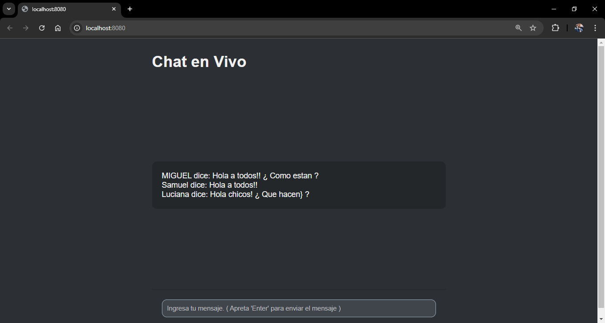

# Nombre del Proyecto: Chat en vivo

Descripción: Este es un chat en vivo que fue creado en el marco del curso de programacion backend.




## Características

- ¿ Que funcion tiene ?
  Este chat funciona en tiempo real, es decir que cuando envias un mensaje la otra persona lo ve al instante.

- ¿ hAY CARACTERISTICAS ESPESIFICAS ?
  Tene en cuenta que al cerrar el chat y apagar el servidor todos los mensajes se eliminan.

- ¿ Que mas se le podria agregar al proyecto ?
  Se le podria agregar una base de datos para guardar los mensajes.
  Tambien se le podria agregar un login en caso de que su uso sea de forma privada en alguna escuela o empresa.

## Tecnologías

- **Backend**: Node.js, Express.js
- **Frontend**: Socket.io, Handlebars. CSS

## Instalación

1. Clona el repositorio:
    ```bash
    git clone https://github.com/tu-usuario/tu-repo.git
    ```
2. Instala las dependencias:
    ```bash
    Despues de clonar el repositorio abris la carpeta, abris una terminal y usas el siguiente comando 
    ' npm install ' esto descargara todas las dependencias mencionadas en el package.json.
    ```

## Uso

1. Inicia el servidor:
    ```bash
    npm start
    ```
2. Accede a la aplicación en (http://localhost:8080).
3. Interactúa con el chat: envía mensajes en tiempo real.

## Estructura del Proyecto

Breve explicación de la estructura de carpetas y archivos principales del proyecto:1
1- node_modules: Contiene las dependencias usas en el proyecto.
2- .vscode: contiene las plabras mencionadas en el proyecto. 
2- img-proyect-capture: contiene el captura de pantalla del proyecto.
4- public: contiene las carpetas de css y js
       css: contiene el archivo styles.css con los estilos del proyecto.
       ja contiene el archivo index.js con la logica del chat del lado del usuario.
5- src: contiene las carpetas de routes, views el archivo app.js.
       routes: contiene el archivo views.router.js con la ruta del index
       views: contiene las carpetas layout y partials
           layout: contiene la estructura basica del handlebars
           partials: en este caso esta varia pero aca se guardan los handlebars que son reutilizados en el proyecto.
        index.handlebars: contiene la estructura del chat.
       app.js: contiene la estructura y logica para el servidor.
6- .gitignore: contiene las carpetas y archivos que son ignorados al momento de cargar el repositorio.
7- package.json: contienen datos importantes para el proyecto.

## Ejemplos

Ejemplos de cómo se ve la interfaz del chat.


## Contacto

Información de contacto:

- Linkedin: https://www.linkedin.com/in/miguel-salazar-5576b7258/ 
- GitHub: https://github.com/Soymigueprogramador?tab=repositories 
- Portfolio: https://mi-porfolio.netlify.app/#proyectos